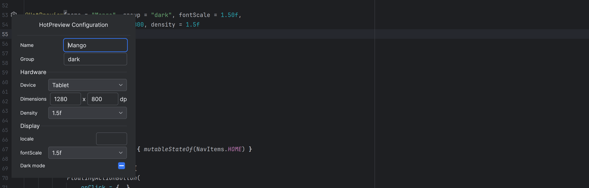

# HotPreview for Compose Multiplatform

HotPreview is a preview system for Compose Multiplatform UI code. Unlike Android Studio's preview system which is limited to Android code only, HotPreview is implemented from scratch specifically for multiplatform development. It allows developers to visualize their Compose UI components. With features like custom device configurations, screen sizes, font scaling, locale and dark mode. HotPreview makes multiplatform UI development faster and more efficient.

The HotPreview system is developed as a IntelliJ plugin using Jewel. It also previews itself. If you want to use it as well in your Jewel plugin projects please see the setup guide here: [Jewel plugin development](JEWEL.md)


## Releases

IntelliJ release notes are here: [RELEASE_NOTES_PLUGIN.md](intellij-plugin/RELEASE_NOTES_PLUGIN.md)
Release notes for the HotPreview annotation dependency are here: https://github.com/timo-drick/Multiplatform-Preview/releases

## Requirements

Supported are projects with:

- Compose Multiplatform versions: 1.7.3, 1.8.0
- Compose for Desktop (CFD) only code.
- Multiplatform projects
    - Common code
    - JVM code
- The module where you use the @HotPreview annotation has to have a jvm target configured.

This is because the previews are rendered using CFD itself.

Supported IDEs:

- IntelliJ 2024.2, 2024.3 (Important: 2025.1 is not supported yet!)
- Android Studio Ladybug, Meerkat

## Usage

### Add dependency to your project

[](https://mvnrepository.com/artifact/de.drick.compose/hotpreview)

```kotlin
dependencies {
    implementation("de.drick.compose:hotpreview:<current version>")
}
```

### Add jvm target

In a multiplatform project you need to add the jvm target to your module:

```kotlin
kotlin {
    
   jvm() // add this line
   // or
   jvm("desktop") // if you have a custom name for the jvm target
   
   // more targets

   sourceSets {
       //...
   }
}
```

### Install IDE plugin

You also need the plugin. It is published already to the  marketplace so just search for HotPreview.

https://plugins.jetbrains.com/plugin/26327-compose-multiplatform-hotpreview

If you want to compile it yourself please see documentation in the intellij project:
[intellij-plugin](intellij-plugin/README.md)

### Use the @HotPreview annotation

In your code use the `@HotPreview` annotation to create previews.

```kotlin
@HotPreview
@Composable
fun PreviewHomeScreen() {
  MyTheme {
    HomeScreen()
  }
}
```

Device configuration can also be set and you can provide multiple annotations:

```kotlin
@HotPreview(
  name = "phone", group = "light", widthDp = 400, heightDp = 800, 
  fontScale = 1.5f, darkMode = false, density = 1f
)
@HotPreview(
  name = "phone dark", group = "dark", widthDp = 1000, heightDp = 800,
  fontScale = 1f, density = 1f
)
@Composable
fun PreviewHomeScreen() {
  MyTheme {
    HomeScreen()
  }
}
```

Or use the gutter icon to change the parameters:




### Annotation classes

HotPreview provides several built-in annotation classes that combine multiple `@HotPreview` annotations for common use cases:

- **HotPreviewScreenSizes**: Previews for different screen sizes (Phone, Phone-Landscape, Foldable, Tablet, Desktop)
- **HotPreviewFontScale**: Previews with different font scales (85% to 200%)
- **HotPreviewLightDark**: Previews in both light and dark modes

#### Using Annotation Classes

```kotlin
// Use any of the built-in annotation classes
@HotPreviewScreenSizes
@Composable
fun PreviewHomeScreen() {
    MyTheme {
        HomeScreen()
    }
}

// Create your own custom annotation class
@Retention(AnnotationRetention.BINARY)
@Target(AnnotationTarget.FUNCTION)
@HotPreview(name = "Phone", widthDp = 411, heightDp = 891, group = "custom")
@HotPreview(name = "Tablet", widthDp = 1280, heightDp = 800, group = "custom")
annotation class MyCustomPreviews

// Usage
@MyCustomPreviews
@Composable
fun PreviewWithCustomSettings() {
    MyTheme {
        HomeScreen()
    }
}
```


### Using HotPreviewParameterProvider

You can use `HotPreviewParameterProvider` to provide mock data for your previews. This allows you to test your composable with different data sets without creating multiple preview functions.

To use this feature:

1. Create a class that implements `HotPreviewParameterProvider<T>` where `T` is the type of data you want to provide:

```kotlin
class WeatherProvider : HotPreviewParameterProvider<Weather> {
    override val values: Sequence<Weather> = weatherForecast.asSequence()
}
```

2. Use the `@HotPreviewParameter` annotation on a parameter in your preview function:

```kotlin
@HotPreview(widthDp = 200, heightDp = 200)
@Composable
private fun PreviewWeatherCanvas(
    @HotPreviewParameter(WeatherProvider::class) weather: Weather
) {
    WeatherCanvas(
        modifier = Modifier.fillMaxSize(),
        seconds = 20.0,
        weather = weather,
    )
}
```

The plugin will use the values provided by your `HotPreviewParameterProvider` to generate previews with different data.


## Coil image preview

If you are using Coil 3 for multiplatform image loading and want to provide a preview image just have a look at the official documentation of coil here: https://coil-kt.github.io/coil/compose/#previews
Of course, it depends on you code how to integrate this into previews. You could also use this approach: https://coil-kt.github.io/coil/compose/#compose-multiplatform-resources

But both ways do work in HotPreview previews.


## Sample code

Here is a sample project using the @HotPreview annotation:
https://github.com/timo-drick/compose_desktop_dev_challenge


## Known limitations

- When at IDE startup a file with previews is opened sometimes the resources can not be loaded. Not sure how to avoid this. If you reopen the file everything should work.
- Recompilation only happens automatically when the source file is saved.
- ~~When adding a @HotPreview annotation to the file you have to close and open the file otherwise Android Studio / IntelliJ will not recognize that it contains a preview.~~
- ~~Following resource resolving functions will not work!~~
  - ~~Res.getUri()~~ (Does work since 0.2.0)
  - ~~Res.readBytes()~~ (Does work since 0.2.0)

## TODO list

- Improve rendering performance
  - increase code analysing performance
  - only render previews which are visible
- Implement a hierarchy viewer to be able to see composable components.
- Implement animation preview.
- Implement interactive mode.
- Maybe support also Android platform for previews using the layoutlib for rendering.
- ~~Implement PreviewParameterProvider like in android~~
- ~~Add support for Annotation classes. Make it possible to create Annotation class with HotPreview annotations.~~
